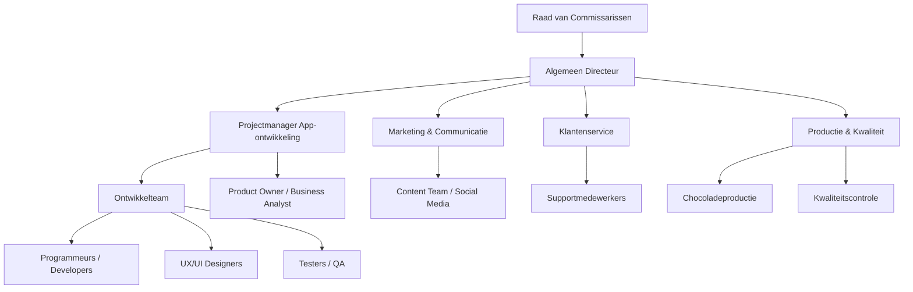

# _Requirements-specificatie_
***BimBonBon***

Welkom bij de requirements specificatie van BimBonBon!! Wij zijn een chocoladebedrijf dat zich richt op het maken van lekkere, kwalitatieve bonbons voor elke gelegenheid. In dit document leggen we uit welke systemen we nodig hebben om ons werk beter en slimmer te doen. We beschrijven op een duidelijke manier wat het bedrijf nodig heeft, zodat zowel de opdrachtgever als het developmentteam precies weet wat er gebouwd moet worden en waarom.

## Organisatorische Context

## Missie
De missie van BimBonBon is om in al ons werk de hoogste kwaliteit te leveren. Wij geloven dat kwaliteit essentieel is voor succes op zowel de korte als lange termijn. Net zoals een bonbon zorgvuldig wordt gemaakt en een unieke smaakbeleving biedt, streven wij ernaar dat onze resultaten betrouwbaar, goed doordacht en met oog voor detail worden uitgevoerd.  

**Kernpunten missie:**  
- Kwaliteit als standaard, niet als keuze  
- Betrouwbaarheid en precisie in uitvoering  
- Zorgvuldige en creatieve aanpak  
- Ervaring en beleving voor klanten en team  

## Visie
BimBonBon is een naam die staat voor kwaliteit, betrouwbaarheid en creativiteit.. We willen inspireren door te laten zien dat werken met zorg, passie en aandacht niet alleen nu, maar ook op de lange termijn een verschil maakt.  

**Kernpunten visie:**  
- Voorbeeld zijn in kwaliteit en oog voor detail  
- Klanten en partners positief verrassen  
- Creatieve en vernieuwende oplossingen ontwikkelen  
- Langdurige waarde creëren voor team, klanten en partners  

## Strategie

BimBonBon gebruikt een duidelijke strategie om de missie en visie waar te maken. De strategie richt zich op kwaliteit, klantgerichtheid, innovatie en duurzaamheid. Door gericht te werken aan korte- en langetermijndoelen kan het bedrijf zijn merk versterken en een sterke klantrelatie opbouwen.  

### Kernpunten van de strategie
- **Kwaliteit centraal**: Alle producten en diensten voldoen aan hoge kwaliteitsnormen. Dit geldt voor de chocolade, de app en de service.  
- **Klantgericht werken**: Klanten krijgen een persoonlijke ervaring, snelle oplossingen voor vragen en klachten, en relevante informatie over producten en acties.  
- **Innovatie en technologie**: Nieuwe functies zoals productregistratie, gepersonaliseerde aanbevelingen, en virtuele fabriekstours worden continu ontwikkeld.  
- **Duurzaamheid en transparantie**: Productherkomst, certificeringen en duurzame keuzes worden zichtbaar voor klanten via de app en communicatiekanalen.  
- **Data gedreven beslissingen**: Klantgegevens en aankoopgedrag worden gebruikt om producten, promoties en de app steeds te verbeteren.  
- **Community en betrokkenheid**: Klanten worden gestimuleerd om deel te nemen aan de community, recepten te delen, challenges te doen en evenementen te bezoeken.  

## Doelstellingen

### Waarom deze doelstellingen
Deze doelstellingen helpen BimBonBon om de klanttevredenheid en loyaliteit te verhogen, de efficiëntie van processen te verbeteren en de positie van het merk te versterken. Door duidelijke korte en langetermijndoelen te stellen, kan het bedrijf gericht werken aan innovatie en klantgerichte oplossingen.

### Binnen 5 maanden
- De mobiele applicatie ontwikkelen en lanceren, inclusief productregistratie en dashboard voor klanten.  
- Basisfunctionaliteiten voor klachtenafhandeling en support beschikbaar maken.  
- Pushnotificaties instellen voor productupdates en seizoensproducten.  

### Binnen 1 jaar
- Gepersonaliseerde aanbevelingen aanbieden op basis van aankoopgeschiedenis en voorkeuren.  
- Integratie van de app met ERP, CRM en BI-tools voor actuele informatie en klantinzichten.  
- Communityfuncties en gamification-elementen toevoegen om klantbetrokkenheid te verhogen.  

### Binnen 3 jaar
- Uitbouwen van exclusieve productervaringen zoals proeverijen, workshops en evenementen.  
- Verdere uitbreiding van duurzame initiatieven en transparantie van productherkomst in de app.  
- Innovatieve functies toevoegen zoals AR-proeverijen en virtuele fabriekstours.  

### Doorlopend
- Kwaliteit, betrouwbaarheid en klantgerichtheid bewaken en verbeteren.  
- Regelmatige updates van de app uitvoeren om nieuwe functionaliteiten toe te voegen en prestaties te verbeteren.  
- Data analyse gebruiken om trends en voorkeuren van klanten te volgen en productontwikkeling te ondersteunen.  
  

## Organogram BimBonBon App

Een organogram laat zien hoe de structuur van een organisatie is opgebouwd, wie verantwoordelijk is voor wat, en hoe de communicatie verloopt. Voor het project van de BimBonBon app is het belangrijk om te weten wie beslissingen neemt, wie de uitvoering doet en wie input levert. Zo weet iedereen in het team waar zijn of haar taken liggen en wie moet worden geraadpleegd bij vragen of problemen.

In ons organogram zie je bijvoorbeeld:
- De **raad van commissarissen** die strategische beslissingen neemt.  
- De **algemeen directeur** die alles coördineert en toezicht houdt.  
- De **projectmanager van de app** die verantwoordelijk is voor het ontwikkelen van de app en het aansturen van het team.  
- Het **ontwikkelteam** dat de app programmeert, ontwerpt en test.  
- **Marketing & communicatie** die ervoor zorgt dat klanten weten van de app en de promoties.  
- **Klantenservice** die vragen en klachten via de app afhandelt.  
- **Productie & kwaliteit** die productinformatie, voorraadstatus en kwaliteitsdata levert.  
- De **klanten zelf**, die de app gebruiken en feedback geven.

### Organogram

## Stakeholderanalyse BimBonBon app

In deze analyse bekijken we de belangrijkste betrokkenen (stakeholders) rondom de BimBonBon app.  
We beschrijven hun belangen, invloed op het project, en wat zij verwachten van het resultaat.  
Dit helpt ons om te zorgen dat we aan de wensen van alle partijen voldoen en effectief kunnen samenwerken.

### Belang, Invloed en Verwachting
- **Belang**: Wat de stakeholder belangrijk vindt in het project.  
- **Invloed**: Hoeveel invloed de stakeholder heeft op beslissingen en uitvoering.  
- **Verwachting**: Wat de stakeholder verwacht of nodig heeft van het project.  

De stakeholders zijn ingedeeld op basis van hun invloed en belang: hoog, middel en laag. Zo kunnen we prioriteiten stellen in communicatie en samenwerking.

### Stakeholders indeling

#### Actief beheren (veel invloed en veel belang)
- **Raad van Commissarissen**  
  - Belang: Succesvolle lancering van de app, betere klantloyaliteit, datagedreven inzichten.  
  - Invloed: Hoog, beslist over goedkeuring en strategische keuzes.  
  - Verwachting: App voldoet aan bedrijfsstrategie en kwaliteitsstandaarden.  
- **Algemeen Directeur / Managementteam**  
  - Belang: Project succesvol uitvoeren, integratie met ERP/CRM.  
  - Invloed: Hoog, stuurt middelen, prioriteiten en team aan.  
  - Verwachting: Efficiënte voortgang, juiste functies en tijdige oplevering.  
- **Projectmanager App-ontwikkeling**  
  - Belang: Het project volgens planning en budget opleveren.  
  - Invloed: Hoog, direct verantwoordelijk voor team en voortgang.  
  - Verwachting: Duidelijke requirements, gemotiveerd team, minimale problemen.  
- **Product Owner / Business Analyst**  
  - Belang: Functionele en zakelijke eisen correct geïmplementeerd.  
  - Invloed: Hoog, bepaalt backlog en prioriteiten.  
  - Verwachting: App voldoet aan businessdoelen en gebruikersbehoeften.  

#### Tevreden houden (weinig invloed maar wel belang)
- **Klanten / Eindgebruikers**  
  - Belang: Gemakkelijk registreren van producten, overzichtelijk dashboard, gepersonaliseerde ervaring.  
  - Invloed: Laag, kunnen niet direct beslissen over features.  
  - Verwachting: Intuïtieve, betrouwbare en veilige app.  
- **Klantenservice**  
  - Belang: Minder meldingen van problemen, makkelijker klachten afhandelen via app.  
  - Invloed: Laag, hebben input over procesverbeteringen maar niet over prioriteiten.  
  - Verwachting: App ondersteunt self-service en reduceert werkdruk.  

#### Monitoren (veel invloed maar weinig belang)
- Momenteel geen stakeholders in deze categorie.

#### Informeren (weinig invloed en weinig belang)
- Momenteel geen stakeholders in deze categorie.
---

[👉 Volgende: Actoren](02_actoren.md)

