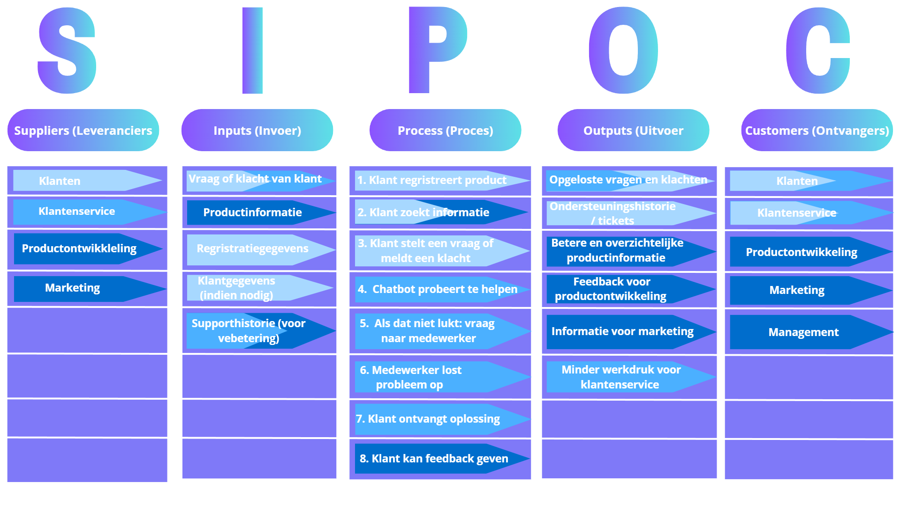

# SIPOC Analyse – Ondersteunend Bedrijfsproces BimBonBon App

Deze pagina bevat de SIPOC analyse van het proces dat door de BimBonBon app wordt ondersteund.  
De SIPOC laat zien wie iets aanlevert, wat er nodig is, wat er gebeurt, wat eruit komt en wie het resultaat krijgt.

---

## Wat is een SIPOC?

SIPOC is een hulpmiddel om een proces duidelijk te maken.

- **S – Suppliers (Leveranciers)**  
  Wie levert de informatie of gegevens?

- **I – Inputs (Invoer)**  
  Wat heeft het proces nodig?

- **P – Process (Proces)**  
  Wat gebeurt er in het proces?

- **O – Outputs (Uitvoer)**  
  Wat komt eruit?

- **C – Customers (Klanten / Ontvangers)**  
  Wie krijgt de output?

Een SIPOC helpt om snel te begrijpen hoe een proces werkt.

---

## Beschrijving van het proces

De app helpt klanten met informatie en ondersteuning over producten.

De klant kan:

- Producten registreren
- Productinformatie bekijken
- Vragen stellen
- Klachten indienen
- Feedback geven

Het systeem helpt door:

- Alle informatie op één plek te zetten  
- Producten te registreren  
- Een chatbot vragen te laten beantwoorden  
- Vragen naar een medewerker te sturen als dat nodig is  
- Klanten feedback te laten geven  
- Gegevens te gebruiken voor marketing en productverbetering  

---

## SIPOC Model

---

## Conclusie

De SIPOC laat zien dat het proces vooral draait om goede informatie en goede ondersteuning.  
De app maakt dit beter door alles overzichtelijk te maken, klanten sneller te helpen en feedback te verzamelen.

---

## Knelpunten in het huidige proces

De huidige manier van werken heeft een aantal problemen:

- Informatie is verspreid en moeilijk te vinden  
- Productregistratie kan fout gaan  
- Vragen en klachten worden langzaam afgehandeld  
- Klantenservice moet veel handmatig werk doen  
- Productontwikkeling krijgt weinig feedback  

De app helpt om deze problemen op te lossen.

---
[👉 Volgende: Productvisie](04-productvisie.md)

