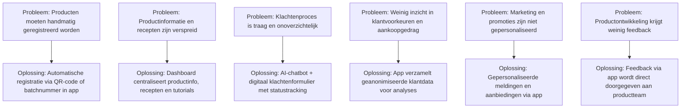

# Bedrijfsprocesanalyse – BimBonBon App

BimBonBon ontwikkelt een mobiele app om de klantervaring te verbeteren, de werkdruk bij klantenservice te verminderen en de communicatie tussen klanten en bedrijf te optimaliseren.  
In deze analyse beschrijven we de belangrijkste bedrijfsprocessen, de huidige situatie (IST), de gewenste situatie (SOLL), de knelpunten (GAP) en gebruiken we een SIPOC-model voor het klantondersteuningsproces.

## Overzicht van de hoofdprocessen binnen BimBonBon
1. **Productregistratie en informatie**  
2. **Marketing en promoties**  
3. **Bestellingen en verkoop**  
4. **Klantenservice en support**  
5. **After sales & feedback**

## IST (Huidige situatie)
Op dit moment verloopt het contact met klanten vooral via e-mail, telefoon en verschillende losse systemen. Het registreren van producten, informatie geven en feedback krijgen is niet goed op elkaar afgestemd. Hierdoor hebben klanten en medewerkers meer moeite en kost het meer tijd.

**Belangrijkste problemen:**
- Producten moeten handmatig worden geregistreerd, wat kan leiden tot fouten
- Productinformatie en recepten zijn verspreid en moeilijk te vinden voor klanten
- Klachtenafhandeling is onoverzichtelijk en traag
- Weinig inzicht in wat klanten kopen en wat hun voorkeuren zijn
- Marketing en promoties zijn niet persoonlijk afgestemd
- Productontwikkeling krijgt weinig directe feedback van klanten

## SOLL (Gewenste situatie)
Met de app hebben klanten één plek om producten te registreren, informatie te bekijken, bestellingen te plaatsen en hulp te krijgen. Alle processen zijn verbonden met interne systemen zoals ERP, CRM en BI tools. Dit maakt het werken makkelijker en sneller voor klanten en medewerkers.

**Verbetermogelijkheden:**
- Producten registreren via QR code of handmatig invoeren
- Dashboard toont productinformatie, recepten en uitlegvideo’s
- Bestellen kan direct via de app, gekoppeld aan ERP
- AI chatbot en digitaal klachtenformulier met statusupdates
- Persoonlijke meldingen en aanbiedingen voor klanten
- Klanten kunnen direct feedback geven aan productontwikkeling
- Gegevens van klanten worden geanalyseerd voor marketing en productverbetering

## GAP analyse – BimBonBon App

De GAP-analyse laat zien wat er nu gebeurt (IST), wat we willen bereiken (SOLL) en welke verbeteringen de app biedt.

