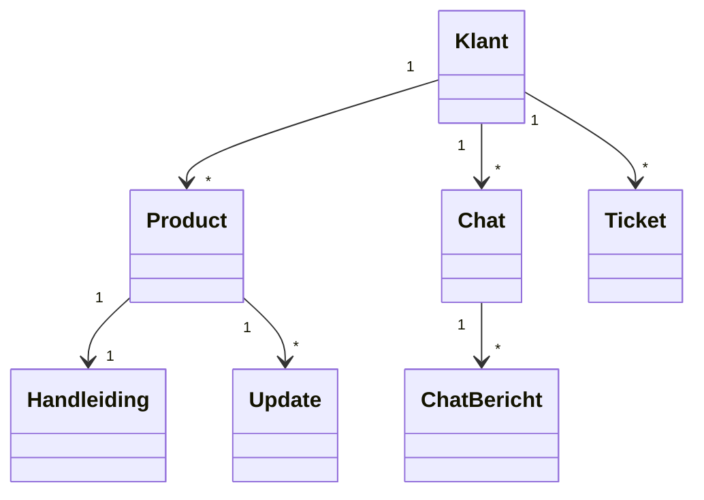
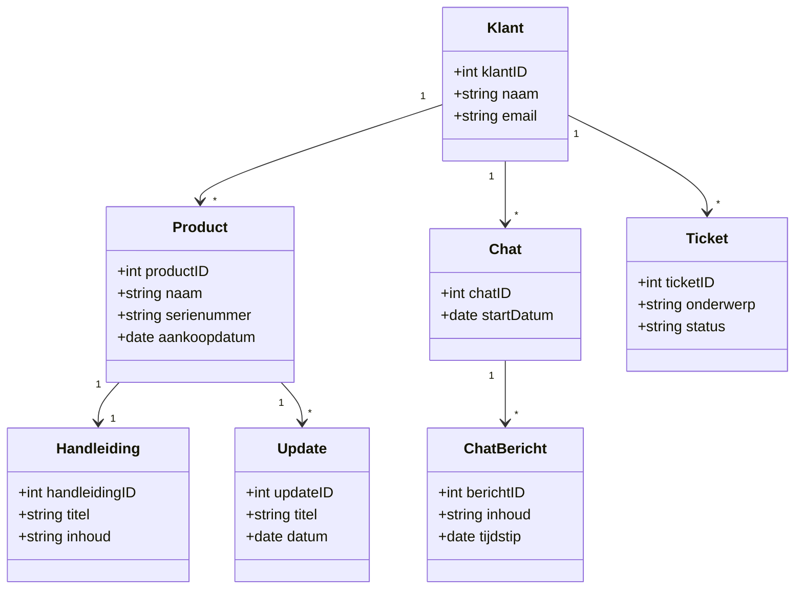

# Domeinmodel en UML Klassendiagram – BimBonBon App

Het domeinmodel en UML-klassendiagram geven inzicht in de belangrijkste onderdelen van het BimBonBon systeem en hoe deze met elkaar samenwerken.  

- Het **domeinmodel** laat de structuur en relaties zien tussen de kernonderdelen, zoals Klanten, Producten, Handleidingen, Updates, Chats en Tickets.  
- Het **UML-klassendiagram** geeft detailinformatie over de attributen van elke klasse, zodat ontwikkelaars precies weten welke gegevens opgeslagen moeten worden en hoe de onderdelen met elkaar verbonden zijn.  

Door eerst een leeg model te maken en daarna het volledig ingevulde diagram toe te voegen, kan het team zowel het overzicht behouden als direct aan de slag met implementatie.

---

# Domeinmodel – BimBonBon App (Leeg)

Het domeinmodel laat de belangrijkste onderdelen van het systeem zien en hoe deze verbonden zijn.

**Uitleg:**

- Dit diagram laat zien welke onderdelen van het systeem bestaan en hoe ze met elkaar verbonden zijn.
- Het is nog leeg qua attributen en dient als overzichtelijk startpunt.
  

**Uitleg:**

Het tweede diagram bevat alle attributen van de klassen.

- Het toont hoe veelvoudige relaties werken (bijvoorbeeld één klant kan meerdere producten hebben).
- Het diagram helpt ontwikkelaars om direct te weten welke data in de database opgeslagen moet worden en hoe de objecten in de app samenwerken.
