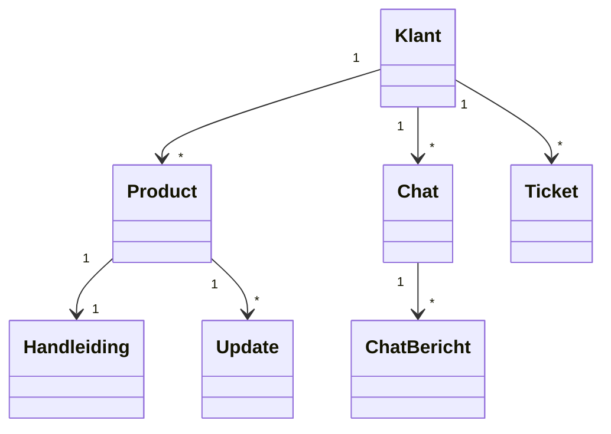

## Domeinmodel – BimBonBon App

Het domeinmodel geeft een overzicht van de belangrijkste onderdelen binnen het BimBonBon-systeem en hoe deze met elkaar verbonden zijn.

In dit model zie je dat een **klant** één of meerdere **producten** kan bezitten. Elk product heeft een **handleiding** en kan meerdere **updates** ontvangen. Klanten kunnen via een **chat** communiceren, waarbij elke chat uit meerdere **chatberichten** bestaat. Daarnaast kunnen klanten **tickets** aanmaken voor extra ondersteuning.  

Dit model helpt om inzicht te krijgen in welke onderdelen het systeem moet bevatten en hoe deze samenwerken om de functionaliteiten in de app te ondersteunen.

# Domeinmodel – BimBonBon App (Leeg)

Het domeinmodel laat de belangrijkste onderdelen van het systeem zien en hoe deze verbonden zijn.



```mermaid
classDiagram
    class Klant {
        +int klantID
        +string naam
        +string email
    }
    class Product {
        +int productID
        +string naam
        +string serienummer
        +date aankoopdatum
    }
    class Handleiding {
        +int handleidingID
        +string titel
        +string inhoud
    }
    class Update {
        +int updateID
        +string titel
        +date datum
    }
    class Chat {
        +int chatID
        +date startDatum
    }
    class ChatBericht {
        +int berichtID
        +string inhoud
        +date tijdstip
    }
    class Ticket {
        +int ticketID
        +string onderwerp
        +string status
    }

    Klant "1" --> "*" Product
    Product "1" --> "1" Handleiding
    Product "1" --> "*" Update
    Klant "1" --> "*" Chat
    Chat "1" --> "*" ChatBericht
    Klant "1" --> "*" Ticket

