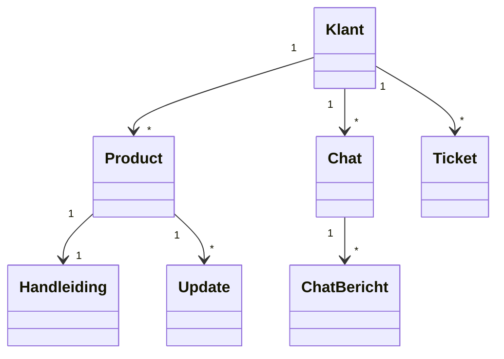
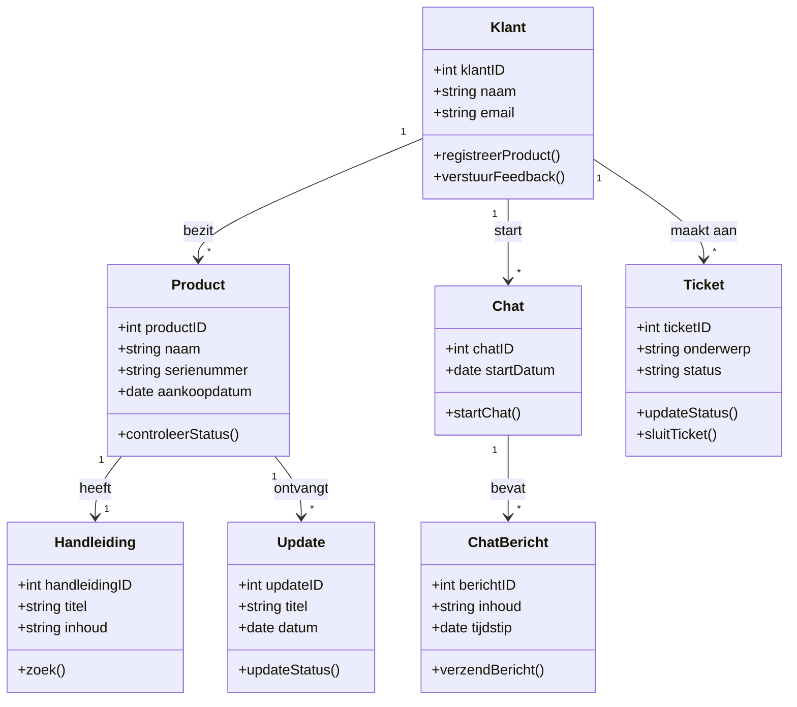

# Domeinmodel en UML Klassendiagram – BimBonBon App

Het domeinmodel en UML-klassendiagram geven inzicht in de belangrijkste onderdelen van het BimBonBon systeem en hoe deze met elkaar samenwerken.  

- Het **domeinmodel** laat de structuur en relaties zien tussen de kernonderdelen, zoals Klanten, Producten, Handleidingen, Updates, Chats en Tickets.  
- Het **UML-klassendiagram** geeft detailinformatie over de attributen van elke klasse, zodat ontwikkelaars precies weten welke gegevens opgeslagen moeten worden en hoe de onderdelen met elkaar verbonden zijn.  

Door eerst een leeg model te maken en daarna het volledig ingevulde diagram toe te voegen, kan het team zowel het overzicht behouden als direct aan de slag met implementatie.

---

# Domeinmodel – BimBonBon App (Leeg)

Het domeinmodel laat de belangrijkste onderdelen van het systeem zien en hoe deze verbonden zijn.

**Toelichting (Leeg model):**

- Dit diagram laat zien welke onderdelen van het systeem bestaan en hoe ze met elkaar verbonden zijn.
- Er zijn nog geen attributen toegevoegd: het dient als overzichtelijk startpunt voor het ontwerp.

---

# Domeinmodel – BimBonBon App (Ingevuld)

**Toelichting (Ingevuld model):**

- Toont alle attributen en methodes van de klassen.
- Laat relaties tussen objecten zien, bijvoorbeeld één klant kan meerdere producten hebben.
- Helpt ontwikkelaars te begrijpen welke data nodig is en hoe onderdelen samenwerken voor functies zoals registratie, support en feedback.
  
