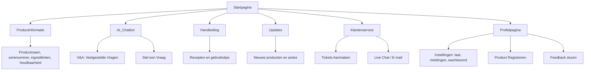

# Sitemap – BimBonBon App
Hieronder zie je de sitemap van de BimBonBon app. Deze sitemap geeft een overzicht van de belangrijkste schermen en functies binnen de app, zodat duidelijk wordt hoe klanten en gebruikers door de app kunnen navigeren. Elke hoofdpagina heeft logische onderverdelingen om de ervaring overzichtelijk, gebruiksvriendelijk en prettig te maken, en om processen zoals productregistratie, klantenservice en feedback efficiënt te ondersteunen.

## Uitleg van de onderdelen

- **Startpagina**: Het beginscherm van de app waar de gebruiker toegang heeft tot alle functies.
- **Productinformatie**: Hier vindt de klant alle details over het geregistreerde product, zoals naam, serienummer, ingrediënten en houdbaarheid.
- **AI Chatbot**: Een slimme assistent die veelgestelde vragen automatisch beantwoordt.
  - **V&A: Veelgestelde Vragen**: Lijst met standaardvragen en -antwoorden.
  - **Stel een Vraag**: Klant kan zelf een vraag intypen en antwoord ontvangen via AI.
- **Handleiding**: Digitale gebruiksaanwijzing voor het product, met tips, recepten en uitleg.
- **Updates**: Informatie over nieuwe producten, acties, of verbeteringen.
- **Klantenservice**: Als de chatbot geen oplossing biedt, kan de klant hier verdere hulp krijgen.
  - **Tickets Aanmaken**: Klant dient een verzoek in voor hulp.
  - **Live Chat / E-mail**: Alternatieve manieren om contact op te nemen met BimBonBon.
- **Profielpagina**: Persoonlijke gegevens van de klant.
  - **Instellingen**: Taal, meldingen, wachtwoord wijzigen.
  - **Product Registreren**: Klant voegt een nieuw product toe aan zijn profiel.
  - **Feedback sturen**: Klant kan feedback geven over producten of de app.

---
