# Sitemap – BimBonBon App
Hieronder zie je de sitemap van de BimBonBon app. Deze sitemap geeft een overzicht van de belangrijkste schermen en functies binnen de app, zodat duidelijk wordt hoe klanten en gebruikers door de app kunnen navigeren. Elke hoofdpagina heeft logische onderverdelingen om de ervaring overzichtelijk, gebruiksvriendelijk en prettig te maken, en om processen zoals productregistratie, klantenservice en feedback snel en makkelijk te ondersteunen.

```mermaid
graph TD
    Startpagina --> Productinformatie
    Startpagina --> AI_Chatbot
    Startpagina --> Handleiding
    Startpagina --> Updates
    Startpagina --> Klantenservice
    Startpagina --> Profielpagina

    AI_Chatbot --> FAQ[V&A: Veelgestelde Vragen]
    AI_Chatbot --> Vraag[Stel een Vraag]

    Klantenservice --> Ticket[Tickets Aanmaken]
    Klantenservice --> Contact[Live Chat / E-mail]

    Profielpagina --> Instellingen[Instellingen: taal, meldingen, wachtwoord]
    Profielpagina --> ProductReg[Product Registreren]
    Profielpagina --> Feedback[Feedback sturen]

    Productinformatie --> ProductDetails[Productnaam, serienummer, ingrediënten, houdbaarheid]
    Handleiding --> Tips[Recepten en gebruikstips]
    Updates --> Nieuw[Nieuwe producten en acties]
```

## Uitleg van de onderdelen

### Startpagina  
Het beginscherm van de app waar de gebruiker toegang heeft tot alle hoofdfuncties, zoals productregistratie, klantenservice en updates.

### Productinformatie  
Hier kan de klant alle details van geregistreerde chocoladeproducten bekijken, zoals productnaam, serienummer, ingrediënten en eventuele recepten of handleidingen.

### AI Chatbot  
Een slimme assistent die veelgestelde vragen automatisch beantwoordt en helpt bij problemen met producten of bestellingen.

- **Veelgestelde Vragen**: Lijst met standaardvragen en antwoorden.  
- **Stel een Vraag**: Klant kan zelf een vraag intypen en antwoord ontvangen via de chatbot.

### Handleiding  
Digitale handleidingen en tutorials voor producten, met tips over gebruik en opslag.

### Updates  
Informatie over nieuwe producten, acties of veranderingen in recepten en productinformatie.

### Klantenservice  
Als de chatbot geen oplossing biedt, kan de klant hier verder geholpen worden.

- **Ticket Aanmaken**: Klant dient een verzoek of klacht in voor extra ondersteuning.  
- **Live Chat / E-mail**: Alternatieve manieren om contact op te nemen met BimBonBon.

### Profielpagina  
Persoonlijke gegevens van de klant, zoals naam en contactinformatie.

- **Instellingen**: Taal, meldingen en wachtwoord aanpassen.  
- **Product Registreren**: Klant voegt een nieuw BimBonBon product toe aan zijn profiel.

---
[👉 Volgende: Wireframes](04-wireframes.md)

