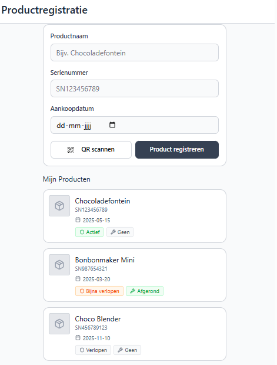
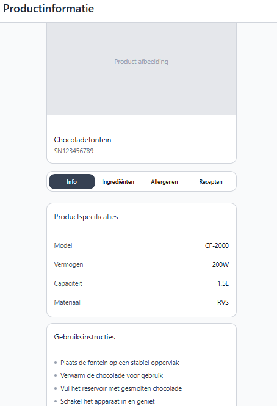
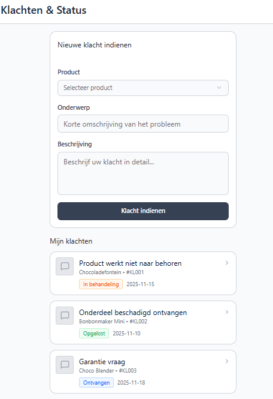
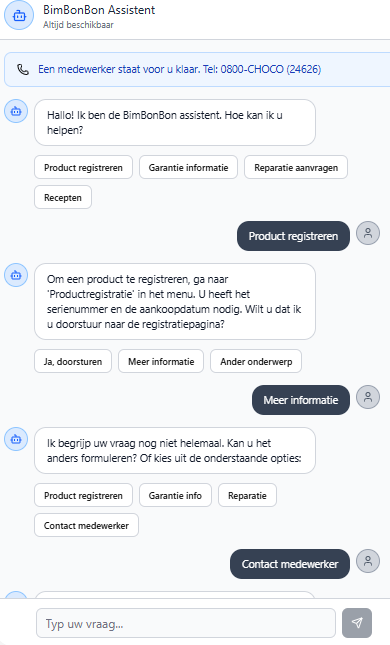
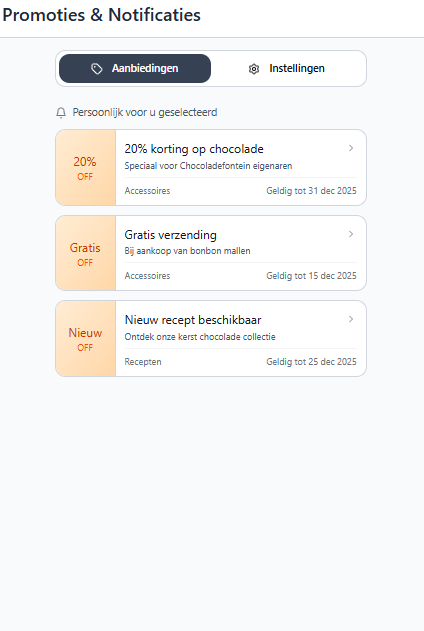
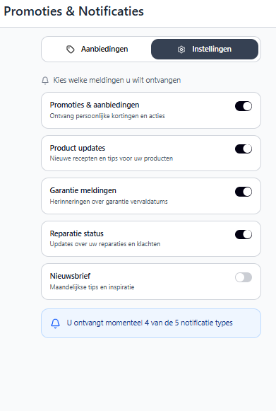
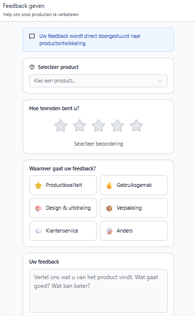

# Wireframes & Beschrijvingen – BimBonBon App

Deze wireframes vormen de basis van de gebruikersinterface voor de BimBonBon app.  
Ze zijn ontworpen om de belangrijkste functies en navigatie overzichtelijk en eenvoudig weer te geven, zodat gebruikers zonder problemen hun weg kunnen vinden.  
In de volgende secties vind je per scherm een korte beschrijving van de doelstellingen en opbouw.

---

## Wireframe 1: Productregistratie
**Doel:**  
Gebruikers kunnen hun chocoladeproduct eenvoudig registreren om toegang te krijgen tot productinformatie, recepten en updates.

**Opbouw:**  
- Header met titel “Productregistratie”
- Formulier met velden: productnaam, QR-code of serienummer, aankoopdatum  
- Knop “Product registreren”  
- Lijst van eerder geregistreerde producten met status  

  

---

## Wireframe 2: Productinformatie & Recepten
**Doel:**  
Gebruikers kunnen alle productinformatie en recepten centraal bekijken, zodat ze niet online hoeven te zoeken.

**Opbouw:**  
- Header met titel “Productinformatie” 
- Overzicht van productdetails: ingrediënten, allergenen, productfoto  
- Lijst van recepten en tutorials  
- Mogelijkheid om specifieke recepten te selecteren of te favorieten  

---

## Wireframe 3: Klachten & Status
**Doel:**  
Gebruikers kunnen een klacht digitaal indienen en de status volgen.

**Opbouw:**  
- Header met titel “Klachten”  
- Formulier om klacht in te dienen: onderwerp, beschrijving, bijlage  
- Statusoverzicht van ingediende klachten: ontvangen, in behandeling, opgelost  
- Knop “Update status” of automatische statusupdates

  

---

## Wireframe 4: AI Chatbot
**Doel:**  
Gebruikers kunnen snel antwoord krijgen op veelgestelde vragen via een chatbot, of doorverbonden worden naar een medewerker.

**Opbouw:**  
- Header met titel “Hulp & Chat” 
- Knoppen voor FAQ categorieën  
- Chatvenster met berichten van gebruiker en chatbot  
- Invoerveld met verzendknop  
- Optie “Doorverbinden met medewerker”

  

---

## Wireframe 5: Persoonlijke promoties & Notificaties
**Doel:**  
Gebruikers ontvangen relevante aanbiedingen en kunnen zelf meldingen beheren.

**Opbouw:**  
- Header met titel “Promoties & Notificaties”  
- Lijst van gepersonaliseerde aanbiedingen  
- Notificatie-instellingen: aan/uit voor updates, aanbiedingen, alerts  
- Optie om meldingen direct te openen of verwijderen

    

---

## Wireframe 6: Feedback geven
**Doel:**  
Gebruikers kunnen feedback achterlaten over producten, zodat het bedrijf hun ervaringen kan gebruiken voor verbeteringen.

**Opbouw:**  
- Header met titel “Feedback”  
- Keuze van product waarop feedback betrekking heeft  
- Beoordeling via sterren  
- Tekstvak voor opmerkingen  
- Knop “Verstuur feedback”  
- Bevestigingsmelding na verzending  

---
[👉 Volgende: Versietabel](09-Versietabel.md)

