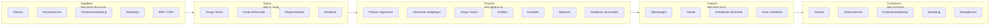

```mermaid
flowchart LR

    %% Suppliers
    subgraph S[Suppliers<br/>Wie levert de inputs]
        S1[Klanten]
        S2[Klantenservice]
        S3[Productontwikkeling]
        S4[Marketing]
        S5[ERP / CRM]
    end

    %% Inputs
    subgraph I[Inputs<br/>Wat is nodig]
        I1[Vraag / klacht]
        I2[Productinformatie]
        I3[Registratiedata]
        I4[Feedback]
    end

    %% Process
    subgraph P[Process<br/>Wat gebeurt er]
        P1[Product registreren]
        P2[Informatie raadplegen]
        P3[Vraag / klacht]
        P4[Chatbot]
        P5[Escalatie]
        P6[Oplossen]
        P7[Feedback verzamelen]
    end

    %% Outputs
    subgraph O[Outputs<br/>Wat komt eruit]
        O1[Oplossingen]
        O2[Tickets]
        O3[Verbeterde informatie]
        O4[Data / feedback]
    end

    %% Customers
    subgraph C[Customers<br/>Wie ontvangt]
        C1[Klanten]
        C2[Klantenservice]
        C3[Productontwikkeling]
        C4[Marketing]
        C5[Management]
    end

    %% Verbindingslijnen
    S --> I
    I --> P
    P --> O
    O --> C
```

