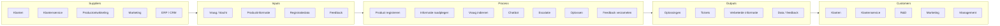

```mermaid
flowchart LR

    %% SIPOC standaard: 5 vakken naast elkaar
    classDef box fill:#ffffff,stroke:#000000,stroke-width:1px;

    subgraph S[Suppliers]
        direction TB
        S1[Klanten]
        S2[Klantenservice]
        S3[Productontwikkeling]
        S4[Marketing]
        S5[ERP / CRM]
    end
    class S box;

    subgraph I[Inputs]
        direction TB
        I1[Vraag / klacht]
        I2[Productinformatie]
        I3[Registratiedata]
        I4[Feedback]
    end
    class I box;

    subgraph P[Process]
        direction TB
        P1[Product registreren]
        P2[Informatie raadplegen]
        P3[Vraag indienen]
        P4[Chatbot]
        P5[Escalatie]
        P6[Oplossen]
        P7[Feedback verzamelen]
    end
    class P box;

    subgraph O[Outputs]
        direction TB
        O1[Oplossingen]
        O2[Tickets]
        O3[Verbeterde informatie]
        O4[Data / feedback]
    end
    class O box;

    subgraph C[Customers]
        direction TB
        C1[Klanten]
        C2[Klantenservice]
        C3[R&D]
        C4[Marketing]
        C5[Management]
    end
    class C box;

    %% arrows
    S --> I
    I --> P
    P --> O
    O --> C
```

