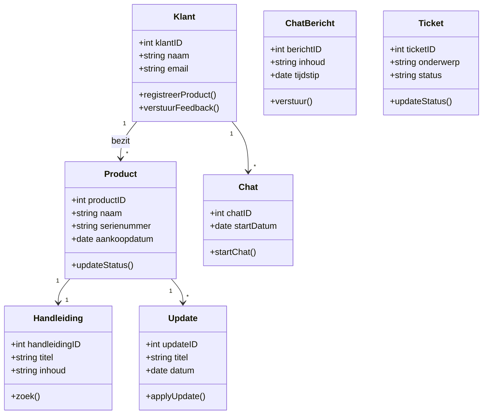

```mermaid
classDiagram
    class Klant {
        +int klantID
        +string naam
        +string email
        +registreerProduct()
        +verstuurFeedback()
    }
    class Product {
        +int productID
        +string naam
        +string serienummer
        +date aankoopdatum
        +updateStatus()
    }
    class Handleiding {
        +int handleidingID
        +string titel
        +string inhoud
        +zoek()
    }
    class Update {
        +int updateID
        +string titel
        +date datum
        +applyUpdate()
    }
    class Chat {
        +int chatID
        +date startDatum
        +startChat()
    }
    class ChatBericht {
        +int berichtID
        +string inhoud
        +date tijdstip
        +verstuur()
    }
    class Ticket {
        +int ticketID
        +string onderwerp
        +string status
        +updateStatus()
    }

    Klant "1" --> "*" Product : bezit
    Product "1" --> "1" Handleiding
    Product "1" --> "*" Update
    Klant "1" --> "*" Chat
```
    Chat "1" --> "*" ChatBericht
    Klant "1" --> "*" Ticket

    subgraph Informeren [Informeren: Laag invloed, laag belang]
        %% Momenteel geen stakeholders in deze categorie
    end
